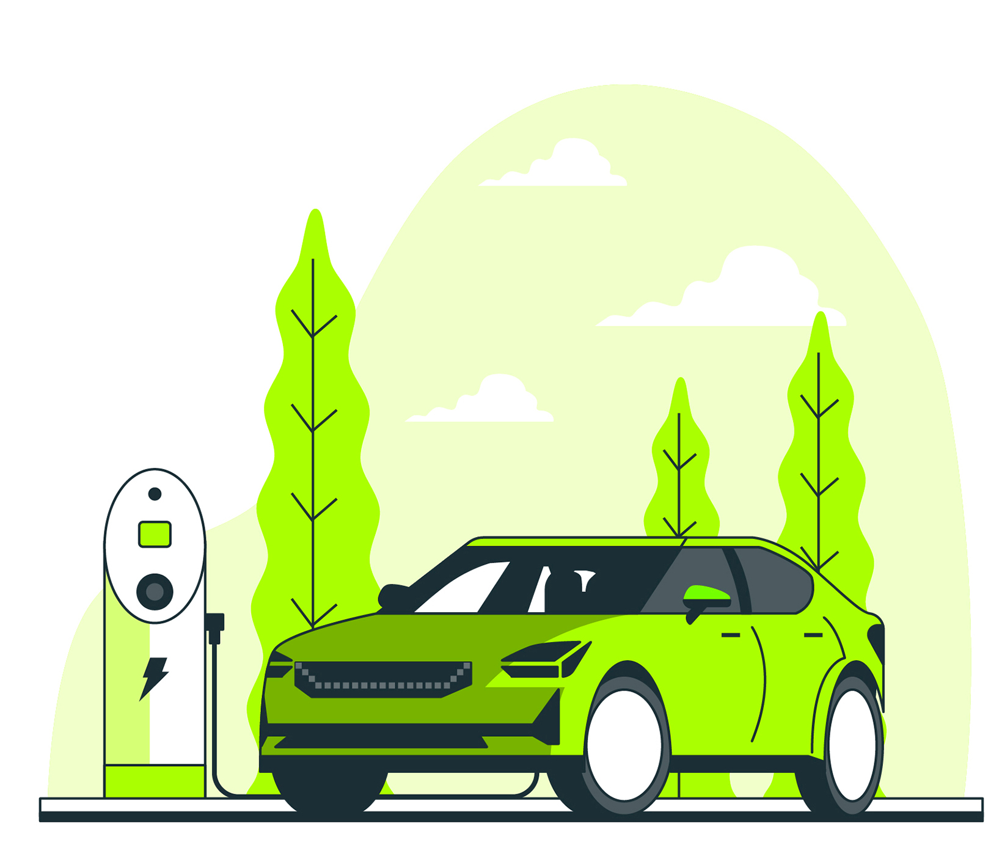
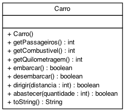

# Carro Ecológico

Essa atividade se propõe a implementar um carro ecológico que pode passear pela cidade. Ele deve poder embarcar e desembarcar pessoas, colocar combustível e andar.



[Designed by slidesgo / Freepik]('https://www.freepik.com/vectors/car)

- [Requisitos](#requisitos)
- [Diagrama](#diagrama)
- [Exemplo de execução](#exemplo-de-execução)
- [Relatório de Entrega](#relatório-de-entrega)


## Requisitos
Seu sistema deverá:

- Inicializar.
    - Iniciar de tanque vazio, sem ninguém dentro e com 0 de quilometragem.
    - Para simplificar, nosso carro esportivo suporta até 2 pessoas e seu tanque suporta até 100 litros de água como combustível.
- Entrando e Saindo.
    - Embarcar uma pessoa por vez.
    - Desembarcar uma pessoa por vez.
        - Não embarque além do limite ou desembarque se não houver ninguém no carro.
- Abastecer.
    - Abastecer o tanque passando a quantidade de litros de combustível.
        - Caso tente abastecer acima do limite, descarte o valor que passou.
- Dirigir.
    - Caso haja pelo menos uma pessoa no carro e **algum combustível**, ele deve gastar combustível andando e aumentar a quilometragem.
    - Nosso carro faz um kilômetro por litro de água.
    - Caso não exista combustível suficiente para completar a viagem inteira, dirija o que for possível e emita uma mensagem indicando quanto foi percorrido.

## Diagrama


## Exemplo de execução 

```java
package br.ufc.qx;

public class Runner {

    public static void main(final String[] args) {
        //Criando um carro
        Carro carro = new Carro();
        System.out.println(carro); // Carro{passageiros=0, combustivel=0, quilometragem=0}

        //Embarcando duas pessoas
        carro.embarcar();
        carro.embarcar();
        System.out.println(carro); // Carro{passageiros=2, combustivel=0, quilometragem=0}

        //Tentando embarcar mais uma pessoas
        if(!carro.embarcar()) {
            System.out.println("Não foi possível realizar o embarque"); // Não foi possível realizar o embarque
        }

        //Desembarcando
        carro.desembarcar();
        carro.desembarcar();
        if(!carro.desembarcar()) {
            System.out.println("Não foi possível desembarcar"); // Não foi possível desembarcar
        }

        //Abastecendo
        carro.abastecer(60);
        System.out.println(carro); // Carro{passageiros=0, combustivel=60, quilometragem=0}

        //Dirigir
        if(!carro.dirigir(10)) {
            System.out.println("Não foi possível dirigir porque o carro estava vazio"); // Não foi possível dirigir porque o carro estava vazio
        }

        //Embarcando e dirigindo
        carro.embarcar();
        carro.dirigir(10);
        System.out.println(carro); // Carro{passageiros=1, combustivel=50, quilometragem=10}

        // Dirigindo até acabar o combustível
        int quilometragemAntigo = carro.getQuilometragem();
        if(!carro.dirigir(70)) {
            int distancia = carro.getQuilometragem() - quilometragemAntigo;
            System.out.println("O combustível acabou ao percorrer " + distancia + " kms"); // O combustível acabou ao percorrer 50 kms
        }
        System.out.println(carro); // Carro{passageiros=1, combustivel=0, quilometragem=60}

        // Abastecendo
        carro.abastecer(200); 
        System.out.println(carro); // Carro{passageiros=1, combustivel=100, quilometragem=60}

    }
}

```


## Relatório de Entrega

Não esqueça de preencher o [Relatório de Entrega](https://forms.gle/ai8SAJoCLqKS9uya9) ao completar a atividade.
